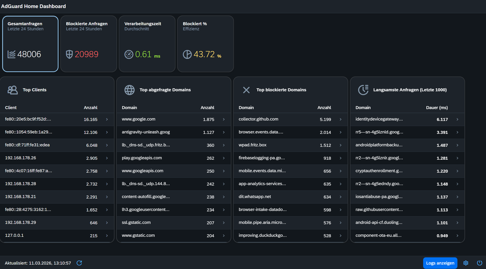

# ui5-agh-dashboard (AdGuard Home Dashboard in UI5)

This repository contains the AdGuard Home Dashboard built with OpenUI5 and TypeScript.

## What is this App?
The **AdGuard Home Dashboard** is a custom management interface for AdGuard Home, programmed in OpenUI5 and TypeScript. It offers a streamlined rich-client application intended to visualize and manage an underlying AdGuard Home instance, providing capabilities such as:
- **Filtering Metrics:** Tracking DNS-level ad/tracker blocking and network analytics.
- **Monitoring & Logs:** Real-time visibility into query logs, blocked connections, and allowed queries.
- **Infrastructure Status:** A customizable interface to monitor your AdGuard Home and Unbound (recursive resolver) health and performance within your local network.

## Preview


## Tech Stack
- **TypeScript**
- **OpenUI5** (Targeting version `1.144.0` / `1.145.0`)
- **Node.js**
- **Package Manager**: npm

## Getting Started

### Prerequisites
- [Node.js](https://nodejs.org/)
- npm (Node Package Manager)

### Installation
Clone the repository and install dependencies:
```bash
git clone https://github.com/sbozbuga/AGHDahboardUI5.git
cd ui5-ts-app
npm install
```

### Development
Start the local development server:
```bash
npm start
```
The application will be served at `http://localhost:8085/index.html`. 

You can also run it with `ui5-dist.yaml` config (distribution build):
```bash
npm run start:dist
```

### Build
To build the project for production:
```bash
npm run build
```
Or for a self-contained build:
```bash
npm run build:opt
```

### Code Quality

**Unified Health Check**: A comprehensive command combining formatting checks, ESLint, UI5 linting, and TypeScript type checks:
```bash
npm run health
```

**Formatting**: Ensure consistent code style with Prettier:
```bash
npm run format        # Automatically fix formatting issues
npm run format:check  # Check for formatting issues without fixing
```

**Linting & Type Checking**: 
```bash
npm run lint          # Run ESLint for JavaScript/TypeScript
npm run ui5lint       # Run UI5-specific linter
npm run ts-typecheck  # Run TypeScript static type checking
```

**Testing**: 
Run unit tests (via UI5 Test Runner):
```bash
npm run test
```
Tests must maintain at least 80% coverage.

Run end-to-end tests (via Playwright):
```bash
npm run test:e2e
```

## Development Environment & Infrastructure
- **DNS**: This project is developed in an environment utilizing **Unbound** and **AdGuard Home**.
- **Constraint**: Do not attempt to modify `/etc/resolv.conf` or local network interface settings directly.
- **Networking**: Outbound port 53 is managed; standard hostnames should be used.

## Coding Standards
- **Naming:** PascalCase for components, camelCase for functions.
- **Patterns:** Functional components are preferred over classes.
- **Documentation:** TSDoc/JSDoc comments are required for every new public function.

## Git Workflow
- **Branching:** Use `feature/` or `fix/` prefixes for branches.
- **Commits:** Follow Conventional Commits format (e.g., `feat: add auth`).
- **PRs:** Always include a summary of "Why" the change was made, not just "What" was changed.

## License
This project is licensed under the Apache-2.0 License.
